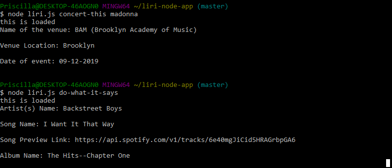

# liri-node-app
LIRI is like iPhone's SIRI. However, while SIRI is a Speech Interpretation and Recognition Interface, LIRI is a Language Interpretation and Recognition Interface. LIRI will be a command line node app that takes in parameters and gives you back data.

# commands
When running this app in command line, you will use the following commands:
 
> $ node liri.js concert-this <artist/band name here>

> $ node liri.js movie-this <movie name here>
 
> $ node liri.js spotify-this-song <song here>
 
> $ node liri.js do-what-it-says 

